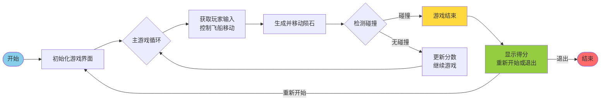

```mermaid
flowchart LR
    A([开始]) --> B[初始化游戏界面]
    B --> C{主游戏循环}
    
    C --> D[获取玩家输入<br>控制飞船移动]
    D --> E[生成并移动陨石]
    E --> F{检测碰撞}
    
    F -->|碰撞| G[游戏结束]
    G --> H[显示得分<br>重新开始或退出]
    H -->|重新开始| B
    H -->|退出| Z([结束])
    
    F -->|无碰撞| I[更新分数<br>继续游戏]
    I --> C
    
    style A fill:#87CEEB
    style Z fill:#FF6B6B
    style G fill:#FFD93D
    style H fill:#95CD41
```