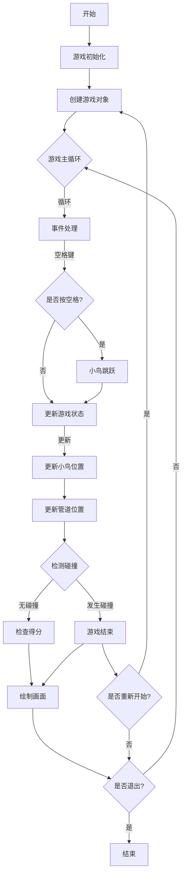

```mermaid
flowchart TD
    Start[开始] --> Init[游戏初始化]
    Init --> CreateObjects[创建游戏对象]
    CreateObjects --> GameLoop{游戏主循环}
    
    GameLoop --> |循环| EventHandle[事件处理]
    EventHandle --> |空格键| JumpControl{是否按空格?}
    
    JumpControl --> |是| BirdJump[小鸟跳跃]
    JumpControl --> |否| UpdateState[更新游戏状态]
    BirdJump --> UpdateState
    
    UpdateState --> |更新| UpdateBird[更新小鸟位置]
    UpdateBird --> UpdatePipes[更新管道位置]
    UpdatePipes --> CheckCollision{检测碰撞}
    
    CheckCollision --> |无碰撞| CheckScore[检查得分]
    CheckCollision --> |发生碰撞| GameOver[游戏结束]
    
    CheckScore --> Draw[绘制画面]
    GameOver --> Draw
    
    Draw --> CheckQuit{是否退出?}
    CheckQuit --> |否| GameLoop
    CheckQuit --> |是| End[结束]
    
    GameOver --> CheckRestart{是否重新开始?}
    CheckRestart --> |是| CreateObjects
    CheckRestart --> |否| CheckQuit
```