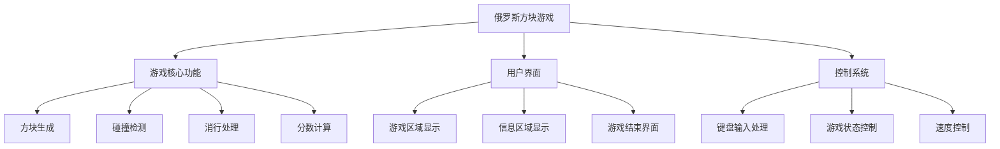

```mermaid
graph TD
    A[俄罗斯方块游戏] --> B[游戏核心功能]
    A --> C[用户界面]
    A --> D[控制系统]

    B --> B1[方块生成]
    B --> B2[碰撞检测]
    B --> B3[消行处理]
    B --> B4[分数计算]

    C --> C1[游戏区域显示]
    C --> C2[信息区域显示]
    C --> C3[游戏结束界面]

    D --> D1[键盘输入处理]
    D --> D2[游戏状态控制]
    D --> D3[速度控制]
```