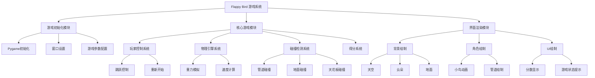

```mermaid
graph TD
    A[Flappy Bird 游戏系统] --> B[游戏初始化模块]
    A --> C[核心游戏模块]
    A --> D[界面渲染模块]
    
    B --> B1[Pygame初始化]
    B --> B2[窗口设置]
    B --> B3[游戏参数配置]
    
    C --> C1[玩家控制系统]
    C --> C2[物理引擎系统]
    C --> C3[碰撞检测系统]
    C --> C4[得分系统]
    
    C1 --> C11[跳跃控制]
    C1 --> C12[重新开始]
    
    C2 --> C21[重力模拟]
    C2 --> C22[速度计算]
    
    C3 --> C31[管道碰撞]
    C3 --> C32[地面碰撞]
    C3 --> C33[天花板碰撞]
    
    D --> D1[背景绘制]
    D --> D2[角色绘制]
    D --> D3[UI绘制]
    
    D1 --> D11[天空]
    D1 --> D12[云朵]
    D1 --> D13[地面]
    
    D2 --> D21[小鸟动画]
    D2 --> D22[管道绘制]
    
    D3 --> D31[分数显示]
    D3 --> D32[游戏状态提示]
```