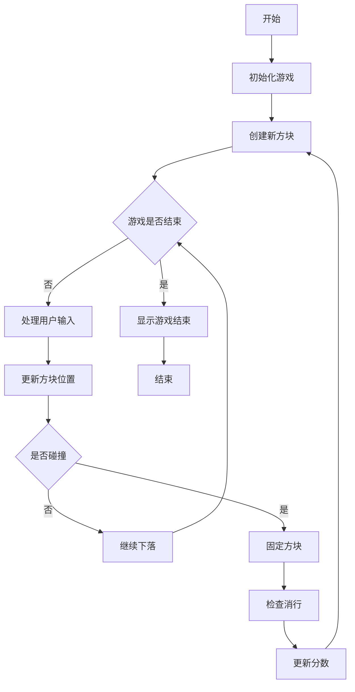

```mermaid
flowchart TD
    A[开始] --> B[初始化游戏]
    B --> C[创建新方块]
    C --> D{游戏是否结束}
    D -- 否 --> E[处理用户输入]
    E --> F[更新方块位置]
    F --> G{是否碰撞}
    G -- 否 --> H[继续下落]
    G -- 是 --> I[固定方块]
    I --> J[检查消行]
    J --> K[更新分数]
    K --> C
    D -- 是 --> L[显示游戏结束]
    L --> M[结束]
    H --> D
```