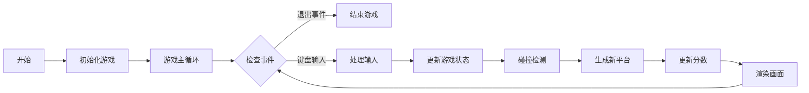

```mermaid
flowchart LR
    A[开始] --> B[初始化游戏]
    B --> C[游戏主循环]
    C --> D{检查事件}
    D --> |退出事件| E[结束游戏]
    D --> |键盘输入| F[处理输入]
    F --> G[更新游戏状态]
    G --> H[碰撞检测]
    H --> I[生成新平台]
    I --> J[更新分数]
    J --> K[渲染画面]
    K --> D
```