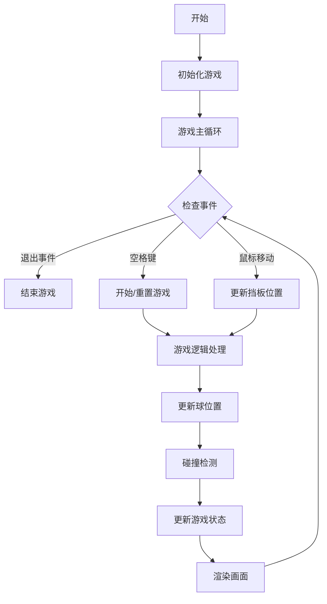

```mermaid
flowchart TD
    A[开始] --> B[初始化游戏]
    B --> C[游戏主循环]
    C --> D{检查事件}
    D --> |退出事件| E[结束游戏]
    D --> |空格键| F[开始/重置游戏]
    D --> |鼠标移动| G[更新挡板位置]
    F --> H[游戏逻辑处理]
    G --> H
    H --> I[更新球位置]
    I --> J[碰撞检测]
    J --> K[更新游戏状态]
    K --> L[渲染画面]
    L --> D
```