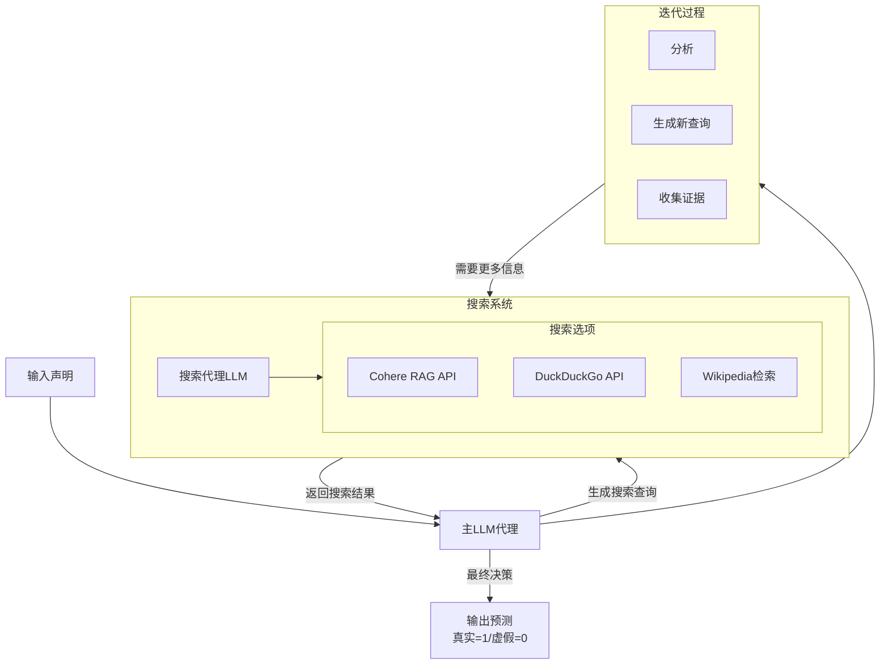

```mermaid
flowchart TD
    Input[输入声明] --> MainAgent[主LLM代理]
    
    subgraph Search[搜索系统]
        SearchAgent[搜索代理LLM]
        
        subgraph Options[搜索选项]
            Cohere[Cohere RAG API]
            DDG[DuckDuckGo API]
            Wiki[Wikipedia检索]
        end
        
        SearchAgent --> Options
    end
    
    MainAgent -->|生成搜索查询| Search
    Search -->|返回搜索结果| MainAgent
    
    subgraph Process[迭代过程]
        Analysis[分析]
        Query[生成新查询]
        Evidence[收集证据]
    end
    
    MainAgent --> Process
    Process -->|需要更多信息| Search
    
    MainAgent -->|最终决策| Output[输出预测\n真实=1/虚假=0]
```