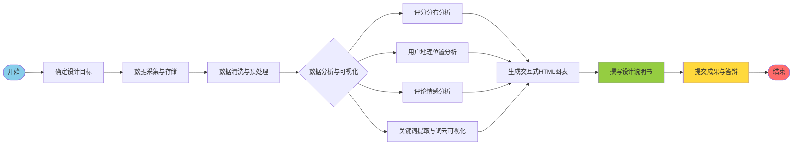

```mermaid
flowchart LR
    A([开始]) --> B[确定设计目标]
    B --> C[数据采集与存储]
    C --> D[数据清洗与预处理]
    D --> E{数据分析与可视化}
    
    E --> F[评分分布分析]
    E --> G[用户地理位置分析]
    E --> H[评论情感分析]
    E --> I[关键词提取与词云可视化]
    
    F --> J[生成交互式HTML图表]
    G --> J
    H --> J
    I --> J
    
    J --> K[撰写设计说明书]
    K --> L[提交成果与答辩]
    L --> Z([结束])

    style A fill:#87CEEB
    style Z fill:#FF6B6B
    style L fill:#FFD93D
    style K fill:#95CD41

```